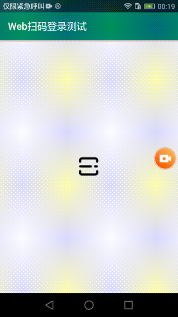

# 基于Scan Kit实现扫码登录，后端为PHP
使用华为Scan Kit实现扫码登录，后端为PHP + Redis，Web前端为JQuery，setTimeout实现轮询，最终实现扫码登录效果，具体参见代码

手机是使用的荣耀6，安卓5.1.1进行测试

## Scan Kit
[Scan Kit文档](https://developer.huawei.com/consumer/cn/codelab/ScanKit-DefaultView/index.html#0)

## 注意
> 首先，确保手机和电脑，处于同一网络，有条件可以部署到自己的服务器
>
> 如果你是PHP工程师，想简单的基于现在的代码进行测试
>
> 务必修改本机ip为：192.168.0.105，并将【scan-kit-test】这个目录放到localhost根目录或者配置一个192.168.0.105虚拟主机
> 
> 访问 http://192.168.0.105/scan-kit-test/index.php 点击按钮生成二维码 
>
> 然后，安装scankit-test.apk，进行测试

-------------
> 如果能找到PHP工程师和Android工程师，那么可以修改对应的访问ip路径等信息
>
> 然后，重新打包进行测试；步骤同上
>

## 最终的效果如下

## 说明
    android-code目录: 里面是安卓的代码
    scan-kit-test目录: PHP + js 页面逻辑代码，以及安卓的一个登录测试接口
    scankit-test.apk: 打包的测试app（注意：测试的ip为：192.168.0.105）

### 测试步骤
> 如果是本地测试
>首先，确保手机和电脑，处于同一网络

1、修改本机IP为：192.168.0.105

2、将【scan-kit-test】这个目录放到localhost根目录或者配置一个192.168.0.105虚拟主机

3、访问 http://192.168.0.105/scan-kit-test/index.php 点击按钮生成二维码 

4、安装scankit-test.apk，扫码登录

---
如果能找到对应的开发者，可以自行修改源码进行测试

